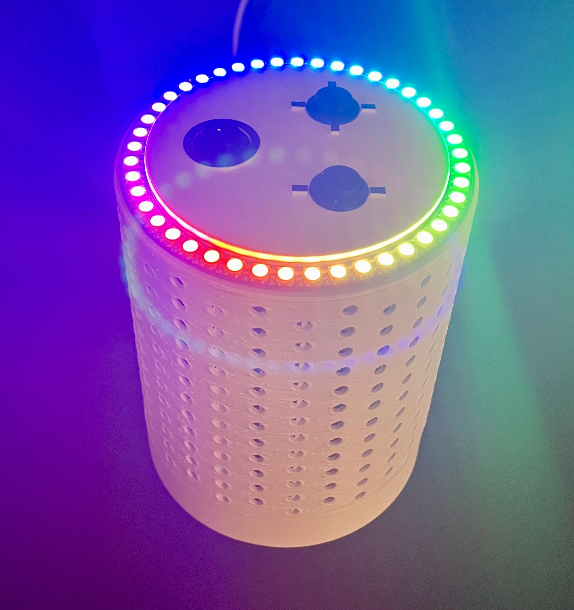
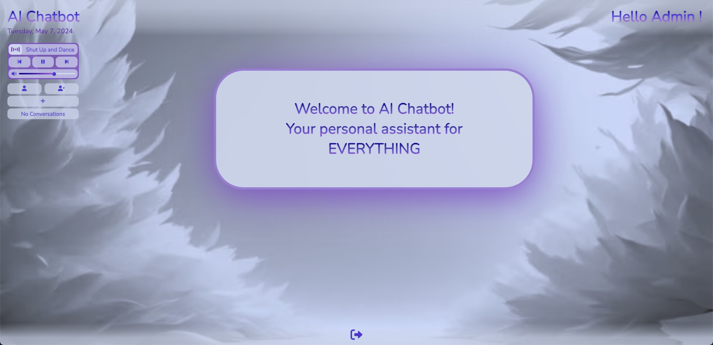
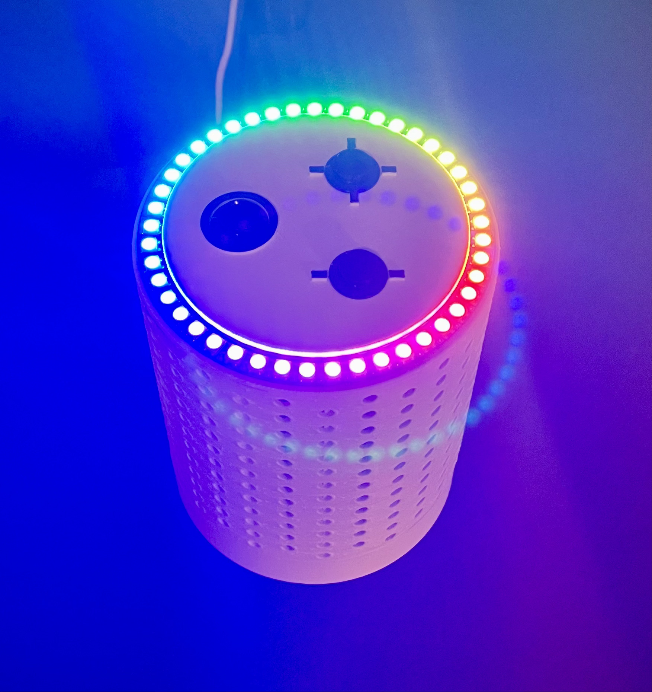
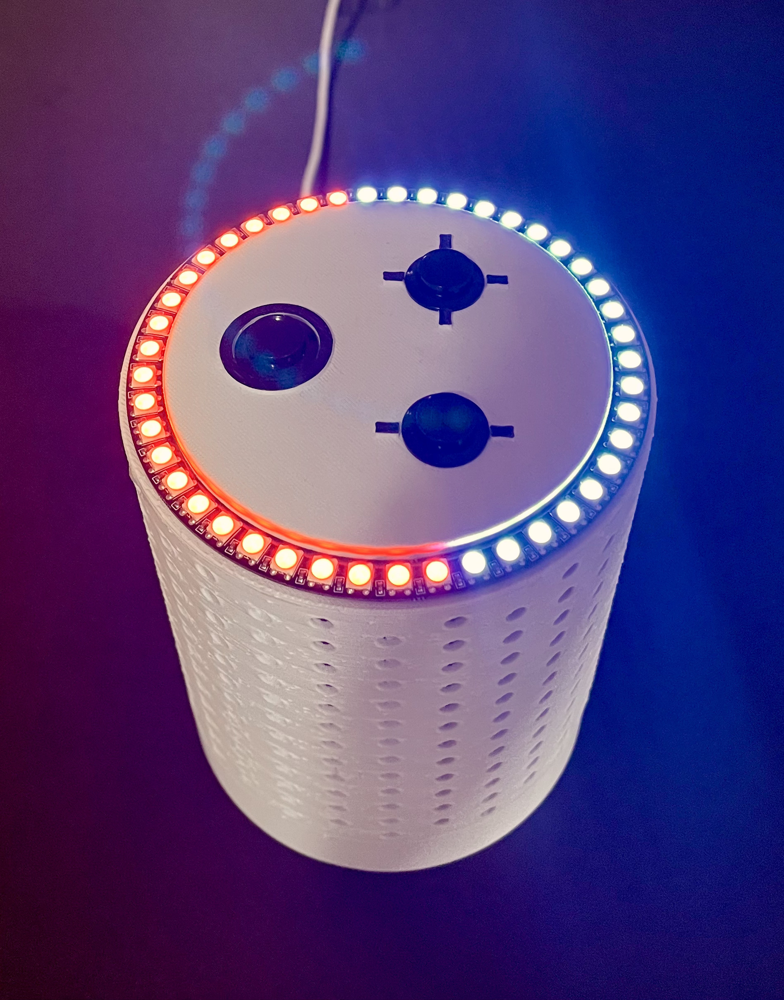
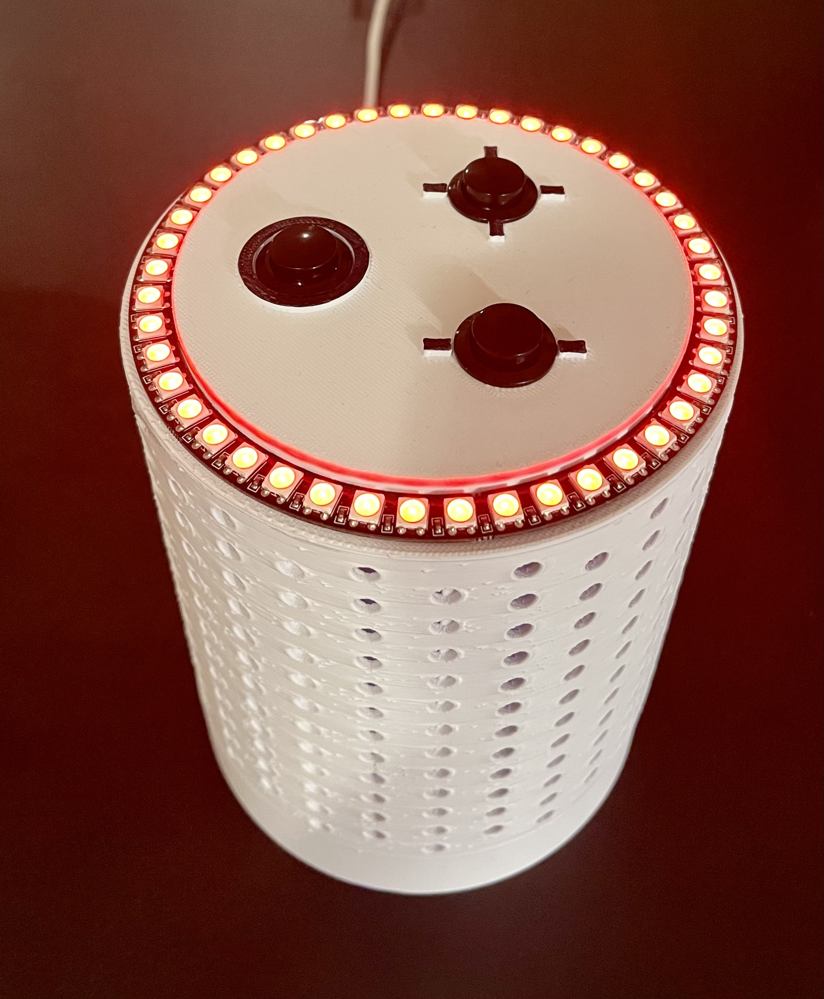

  

# AI Voice Assistant

  Voice assistant capable of responding to complex prompts and playing music requests received through speech or remotely accessible web interface. Includes accessories such as verbal, textual, and tactile input options to manipulate device settings (volume, sleep, reboot, shutdown), conversation flow (resetting memory, verbal response termination), and music playback (pause, resume, previous, next). The web interface was based on the MERN stack structure and includes features such as secure user authentication and login using password encryption and JWT access tokens, special interface options for admins (activating user accounts, deleting users, music playback control, voice assistant volume manipulation, song search suggestions), creating multiple conversation threads, and full-screen conversation mode. Both the frontend and backend were hosted on EC2 instances, request routing was handled using Route 53, and access over HTTPS was enabled by Caddy.

## Demo the site here:

  

## Listening for user prompt:

  

## Volume level visualization:

  

## Sleep mode:

  

